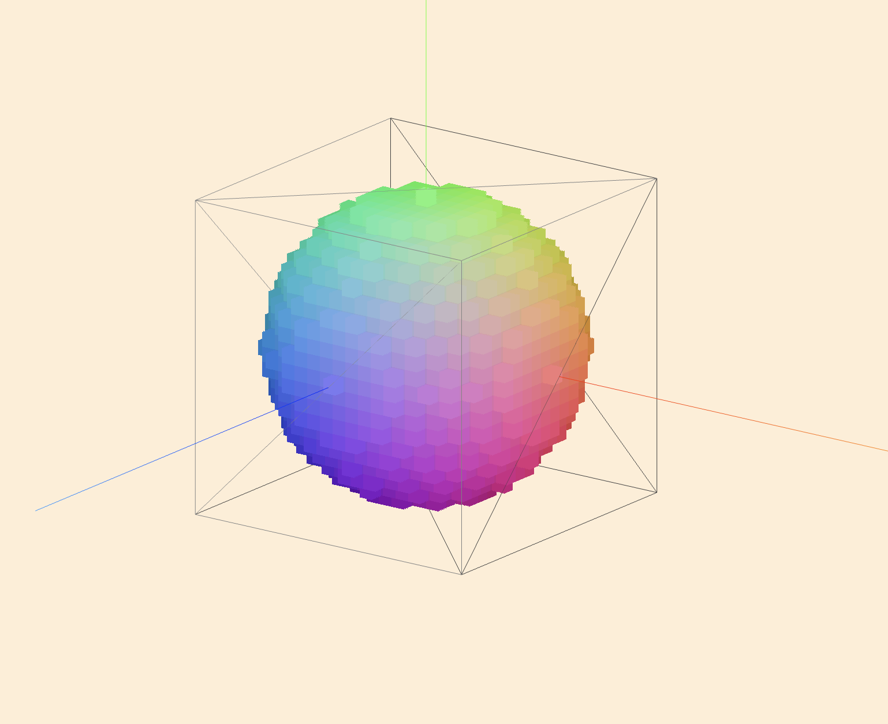

# Voxel Renderer



This repository houses both the code and reports for my final year engineering thesis where I created a voxel rendering engine. You can you view the [full report here](https://github.com/AlexMcDermott/EGH400-VoxelEngine/blob/main/assessment/Delivery/Delivery%20Report.pdf) as well as [live app hosted with GitHub Pages here](https://alexmcdermott.github.io/EGH400-VoxelEngine/).

## Running the App

```bash
cd app
pnpm i
pnpm dev
```

## Deploy

```bash
cd app
pnpm run deploy
```
